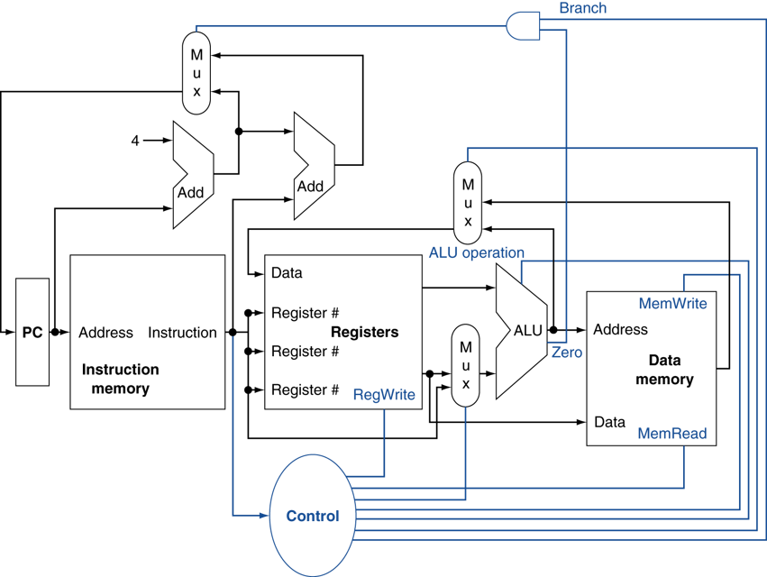

# Computer Architecture

## Datapath

### Datapath without control signal

### Datapath with control signal

## Instruction Set

### Format

- R-type

  - add rd, rs, rt
  - sub rd, rs, rt
  - and rd, rs, rt
  - or  rd, rs, rt
  - slt rd, rs, rt
- I-type

  - lw   rt, rs, imm16
  - st   rt, rs, imm16
  - addi rt, rs, imm16
  - beq  rt, rs, imm16
- J-type

  - j target

## Pipelining

### Single cycle datapath

- IF(Instruction Fetch)
- ID(Instruction Decode and register file read)
- EX(Execution or address calculation)
- MEM(Data memory access)
- WB(Write back)
