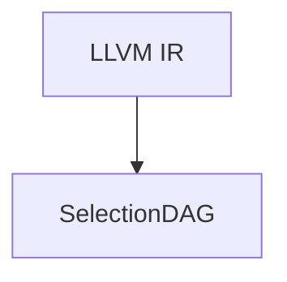

# LLVM IR -> Lower IR before instruction selection

|Steps |Represent |Description |
|:-----|:---------|:-----------|
|1     |LLVM IR   |IR Phase    |
|2     |SelectionDAG |SelectionDAGBuilder, it represent a basic block |

